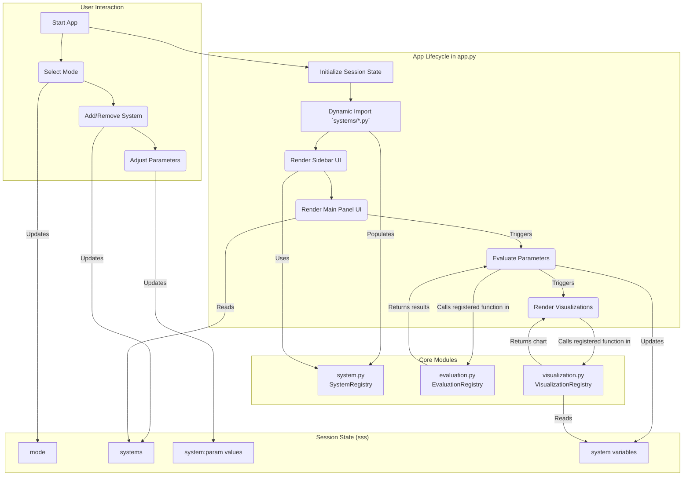

# Exergy Dashboard: 상세 설명 및 I/O 문서

## 1. 프로젝트 개요

Exergy Dashboard는 다양한 에너지 시스템의 엑서지(Exergy) 분석을 손쉽게 수행할 수 있도록 설계된 대시보드 애플리케이션입니다. 사용자는 다양한 시스템을 등록하고, 각 시스템의 파라미터를 입력하여 엑서지 분석 결과를 시각적으로 확인할 수 있습니다.

### 1.1. 개발 목표

이 프로젝트의 목표는 다양한 시스템과 모드(냉방, 난방, 온수 등)에 대해 손쉽게 엑서지 분석을 수행할 수 있는 범용적이고 확장 가능한 대시보드를 개발하는 것입니다. 이를 통해 누구나 새로운 시스템과 평가/시각화 함수를 쉽게 추가할 수 있도록 설계되었습니다.

### 1.2. 주요 기능

-   **다양한 시스템 및 모드 지원**: ASHP, GSHP 등 여러 시스템과 냉방, 난방, 온수 등 다양한 운전 모드를 지원합니다.
-   **파라미터 관리**: 시스템별 파라미터 입력 및 관리 기능을 제공합니다.
-   **동적 평가 함수**: 엑서지 평가 함수를 손쉽게 등록하고 실행할 수 있습니다.
-   **시각적 분석**: Altair 기반의 시각화 함수를 등록하여 대시보드에서 결과를 시각적으로 제공합니다.
-   **웹 기반 UI**: Streamlit 기반의 웹 대시보드를 통해 사용자 친화적인 인터페이스를 제공합니다.
-   **높은 확장성**: 사용자 정의 시스템, 평가, 시각화 함수를 쉽게 추가하고 확장할 수 있습니다.

## 2. 기술 스택

-   **언어**: Python 3.11+
-   **웹 프레임워크**: Streamlit
-   **데이터 시각화**: Altair, Pandas
-   **패키지 관리**: uv
-   **문서화**: Markdown

## 3. 상세 동작 원리 및 아키텍처

이 섹션에서는 Exergy Dashboard의 내부 동작 방식과 데이터 흐름, 그리고 애플리케이션의 생명주기를 상세히 설명합니다.

### 3.1. 데이터 흐름 다이어그램

다음 다이어그램은 사용자의 입력부터 시작하여 데이터가 각 모듈을 거쳐 최종적으로 시각화되는 전체 과정을 보여줍니다.



### 3.2. 애플리케이션 생명주기 (`app.py`)

`app.py`는 Streamlit 기반으로 실행되며, 다음과 같은 생명주기를 가집니다.

1.  **초기화 단계**:
    -   **동적 모듈 임포트**: `app.py`가 실행되면 가장 먼저 `systems/` 디렉토리 내의 모든 `*_system.py` 파일을 동적으로 임포트합니다. 이 과정을 통해 각 파일에 정의된 시스템, 평가, 시각화 함수들이 각자의 레지스트리에 자동으로 등록됩니다.
    -   **세션 상태(`sss`) 초기화**: Streamlit의 `session_state`를 `sss`라는 축약 변수로 사용합니다. 사용자의 현재 선택 모드(`mode`), 추가된 시스템 목록(`systems`), 각 시스템의 파라미터 개수(`system_count`) 등이 초기화됩니다. 이 상태는 사용자가 앱과 상호작용하는 동안 계속 유지됩니다.

2.  **UI 렌더링 및 상호작용**:
    -   **사이드바 렌더링**: `st.sidebar` 내부에 모드 선택(Segmented Control), 시스템 추가(Selectbox, Button), 비교할 시스템 선택(Radio) 위젯을 렌더링합니다. 각 위젯의 값은 `session_state`와 양방향으로 바인딩됩니다.
    -   **메인 패널 렌더링**: 사용자가 사이드바에서 선택한 시스템의 파라미터 입력 위젯(`st.number_input`)들을 렌더링합니다. 각 입력 위젯의 `key`는 `{system_name}:{parameter_name}` 형식으로 지정되어 `session_state`에 독립적으로 저장됩니다.

3.  **상태 업데이트 및 자동 재실행**:
    -   **콜백 함수**: 'Add to List'나 'Remove system' 버튼 클릭 시, `on_click` 인자에 연결된 콜백 함수(`add_system`, `remove_system`)가 실행되어 `sss.systems` 딕셔너리를 직접 수정합니다.
    -   **자동 평가**: 파라미터가 변경될 때마다 Streamlit은 스크립트를 재실행합니다. 이때 `evaluate_parameters(sss, system_name)` 함수가 자동으로 호출되어 변경된 파라미터 값으로 재계산을 수행하고, 결과를 `sss.systems[...]['variables']`에 업데이트합니다.
    -   **시각화 업데이트**: 평가 결과가 업데이트되면, `VisualizationManager`가 해당 모드에 등록된 시각화 함수들을 실행하여 차트를 다시 렌더링합니다.

### 3.3. 환경 및 배포 설정

-   **`pyproject.toml`**: `uv`를 위한 프로젝트 설정 파일입니다. `[project]` 섹션에는 이름, 버전, 설명 등 메타데이터가, `[project.dependencies]`에는 실행에 필요한 Python 패키지 목록이 명시되어 있습니다. `uv sync` 명령어는 이 파일을 읽어 의존성을 설치합니다.
-   **`Dockerfile`**: 애플리케이션을 컨테이너화하기 위한 빌드 명세입니다.
    -   `FROM python:3.11-slim`: 가벼운 Python 3.11 이미지를 기반으로 합니다.
    -   `COPY . .`: 프로젝트 전체 파일을 컨테이너로 복사합니다.
    -   `RUN pip install uv && uv sync`: `uv`를 설치하고, `pyproject.toml`에 명시된 의존성을 설치합니다.
    -   `CMD ["streamlit", "run", "app.py"]`: 컨테이너가 시작될 때 실행할 기본 명령어입니다.
-   **`docker-compose.yml`**: 다중 컨테이너 Docker 애플리케이션을 정의하고 실행하기 위한 파일입니다.
    -   `services.app`: `app`이라는 서비스(컨테이너)를 정의합니다.
    -   `build: .`: 현재 디렉토리의 `Dockerfile`을 사용하여 이미지를 빌드합니다.
    -   `ports: - "8501:8501"`: 호스트의 8501 포트를 컨테이너의 8501 포트(Streamlit 기본 포트)로 매핑합니다.
    -   `volumes: - .:/app`: 호스트의 현재 디렉토리를 컨테이너의 `/app` 디렉토리와 동기화(마운트)하여, 코드 변경 시 컨테이너를 재빌드할 필요 없이 바로 적용되도록 합니다.

## 4. API 레퍼런스: 상세 I/O

이 섹션에서는 Exergy Dashboard를 구성하는 핵심 함수와 클래스의 입출력(I/O)을 상세하게 설명합니다.

---

### 4.1. `exergy_dashboard.system`

시스템의 등록과 관리를 담당하는 모듈입니다.

#### **`register_system(mode, system_type, system_config)`**
- **설명**: 새로운 분석 시스템을 전역 레지스트리에 등록합니다.
- **입력 (Inputs)**:
    - `mode` (`str`): 시스템이 사용될 운전 모드. (예: `'COOLING'`, `'HEATING'`)
    - `system_type` (`str`): 시스템의 고유 타입. (예: `'ASHP'`, `'MyCustomSystem'`)
    - `system_config` (`dict`): 시스템의 상세 구성을 정의하는 딕셔너리. `get_system_template()`을 참조하여 작성합니다.
- **출력 (Output)**: `None`

#### **`get_system_template()`**
- **설명**: 새로운 시스템을 정의할 때 사용할 수 있는 표준 템플릿 딕셔너리를 반환합니다.
- **입력 (Inputs)**: 없음
- **출력 (Output)**:
    - `dict`: 시스템 구성 템플릿. 필수 필드와 데이터 타입에 대한 가이드를 포함합니다.
    ```python
    {
        'display': { 'title': str, 'icon': str },
        'parameters': {
            'param_name': {
                'explanation': {'EN': str, 'KR': str},
                'latex': str,
                'default': float,
                'range': [float, float],
                'unit': str,
                'step': float,
                'category': str (optional)
            }
        }
    }
    ```

#### **`get_systems()`**
- **설명**: 현재 레지스트리에 등록된 모든 시스템의 정보를 깊은 복사(deep copy)하여 반환합니다.
- **입력 (Inputs)**: 없음
- **출력 (Output)**:
    - `dict`: 등록된 모든 시스템 정보. `{mode: {system_type: config}}` 구조를 가집니다.

---

### 4.2. `exergy_dashboard.evaluation`

시스템의 성능 및 엑서지 계산을 담당하는 평가 함수를 관리하는 모듈입니다.

#### **`@registry.register(mode, system_type)`**
- **설명**: 평가 함수를 레지스트리에 등록하는 데코레이터입니다.
- **입력 (Decorator Inputs)**:
    - `mode` (`str`): 평가 함수가 적용될 운전 모드.
    - `system_type` (`str`): 평가 함수가 계산을 수행할 시스템 타입.
- **함수 시그니처 (Decorated Function Signature)**:
    - **입력**: `params` (`dict`): 키는 파라미터 이름(`str`), 값은 해당 파라미터의 값(`float`).
    - **출력**: `dict`: 계산된 모든 변수(중간값 포함)를 담은 딕셔너리. 키와 값 모두 `str` 또는 `float`입니다.
    ```python
    @registry.register('HEATING', 'ASHP')
    def evaluate_heating_ashp(params: dict) -> dict:
        T_0 = params['T_0']
        # ... more calculations ...
        X_h = Q_h * (1 - T_0 / T_h)
        return locals() # 모든 지역 변수를 반환
    ```

#### **`evaluate_parameters(sss, system_name)`**
- **설명**: Streamlit 세션 상태(session state)와 연동하여 특정 시스템의 평가를 수행하는 통합 함수입니다.
- **입력 (Inputs)**:
    - `sss` (`streamlit.delta_generator.DeltaGenerator`): Streamlit의 `session_state` 객체.
    - `system_name` (`str`): 평가를 수행할 대상 시스템의 이름.
- **출력 (Output)**:
    - `dict`: 평가 함수가 반환한 계산 결과 딕셔너리. 이 값은 `sss.systems[system_name]['variables']`에 자동으로 저장됩니다.

---

### 4.3. `exergy_dashboard.visualization`

계산 결과를 시각화하는 차트 함수를 관리하는 모듈입니다.

#### **`@registry.register(mode, name)`**
- **설명**: 시각화 함수를 레지스트리에 등록하는 데코레이터입니다.
- **입력 (Decorator Inputs)**:
    - `mode` (`str`): 이 시각화가 표시될 운전 모드.
    - `name` (`str`): 대시보드 탭에 표시될 시각화의 이름.
- **함수 시그니처 (Decorated Function Signature)**:
    - **입력**:
        - `session_state` (`streamlit.delta_generator.DeltaGenerator`): Streamlit의 `session_state` 객체.
        - `selected_systems` (`list[str]`): 사용자가 UI에서 선택한 시스템들의 이름 리스트.
    - **출력**: `altair.Chart`: Altair 라이브러리로 생성된 차트 객체.
    ```python
    @registry.register('COOLING', 'COP Distribution')
    def plot_cop_dist(session_state, selected_systems):
        # ... 데이터 처리 ...
        df = pd.DataFrame(...)
        chart = alt.Chart(df).mark_bar().encode(...)
        return chart
    ```

#### `VisualizationManager` 클래스
- **설명**: 등록된 시각화 함수들을 관리하고, Streamlit UI에 탭 형태로 렌더링하는 역할을 담당합니다. `app.py`에서 주로 사용됩니다.
- **주요 메서드**:
    - **`__init__(self, registry)`**: `VisualizationRegistry` 인스턴스를 받아 초기화합니다.
    - **`render_tabs(self, session_state, selected_systems, mode)`**: 현재 선택된 모드에 등록된 모든 시각화를 가져와 Streamlit 탭으로 구성하고 각 탭에 차트를 렌더링합니다. 오류 발생 시 UI에 에러 메시지를 표시합니다.

## 5. 사용법 및 예제

새로운 시스템을 추가하고 실행하는 전체 과정은 다음과 같습니다.

1.  **시스템 파일 생성**: `systems/my_new_system.py` 파일을 생성합니다.
2.  **코드 작성**: 파일에 시스템, 평가, 시각화 함수를 정의하고 등록합니다.

    ```python
    # systems/my_new_system.py
    from exergy_dashboard.system import register_system
    from exergy_dashboard.evaluation import registry as eval_registry
    from exergy_dashboard.visualization import registry
    import altair as alt
    import pandas as pd

    # 1. 시스템 정의 및 등록
    my_system = { ... } # 4.1. 구조 참조
    register_system('MY_MODE', 'MY_SYSTEM', my_system)

    # 2. 평가 함수 등록
    @eval_registry.register('MY_MODE', 'MY_SYSTEM')
    def evaluate_my_system(params):
        # ... 계산 로직 ...
        return {'my_result': 123}

    # 3. 시각화 함수 등록
    @registry.register('MY_MODE', 'My Result Vis')
    def plot_my_vis(session_state, selected_systems):
        # ... 시각화 로직 ...
        return alt.Chart(...)
    ```

3.  **애플리케이션 실행**: `app.py`가 실행되면 `systems` 디렉토리의 `*_system.py` 파일을 자동으로 임포트하여 시스템을 로드합니다.

    ```bash
    uv sync
    streamlit run app.py
    ```

## 6. 폴더 구조

```
.
├── app.py                  # Streamlit 메인 애플리케이션
├── Dockerfile              # Docker 이미지 빌드 설정
├── docker-compose.yml      # Docker Compose 설정
├── docs/                   # 프로젝트 문서
├── examples/               # 예제 코드
├── notebooks/              # 데이터 분석 및 테스트용 노트북
├── src/
│   └── exergy_dashboard/   # 메인 소스 코드
│       ├── system.py       # 시스템 등록 및 관리
│       ├── evaluation.py   # 평가 함수 레지스트리
│       └── visualization.py# 시각화 함수 레지스트리
└── systems/                # 사용자 정의 시스템 모듈
    ├── cooling_system.py
    └── heating_system.py
``` 

## 7. 대시보드 사용 가이드 (End-User Guide)

이 절에서는 **개발 경험이 없는 일반 사용자**도 Exergy Dashboard를 빠르게 체험하고 활용할 수 있도록 단계별 안내를 제공합니다.

### 7.1. 빠른 실행 (Docker 사용)

추가적인 파이썬 환경 설정 없이도 Docker만 설치되어 있으면 한 줄 명령어로 대시보드를 실행할 수 있습니다.

```bash
# 1) 프로젝트 루트에서 이미지 빌드 및 실행 (백그라운드)
docker compose up -d --build

# 2) 브라우저에서 대시보드 접속
# 기본적으로 http://localhost:8501 에서 실행됩니다.
```

*Tip*: 이미 포트 8501을 사용 중인 경우, `docker-compose.yml` 파일의 **ports** 항목(`8501:8501`)에서 호스트 포트를 다른 값으로 바꾼 후 재실행하세요.

### 7.2. 로컬 환경에서 실행 (파이썬 가상환경)

```bash
# 1) 의존성 설치 (uv 사용)
uv sync

# 2) 대시보드 실행
streamlit run app.py
```

실행 후 터미널에 표시되는 URL(기본값: http://localhost:8501)을 브라우저에 입력하면 대시보드가 나타납니다.

### 7.3. 첫 화면 둘러보기

1. **사이드바**
   - 분석 *모드* 선택: 냉방, 난방, 온수 등.
   - 시스템 *추가/제거* 버튼: 원하는 시스템을 체크박스로 선택합니다.
2. **메인 패널**
   - 각 시스템 카드: 파라미터 슬라이더와 입력창이 자동으로 생성됩니다.
   - **Calculate** 버튼: 모든 시스템의 파라미터 설정이 끝나면 클릭하여 결과를 계산합니다.
   - **시각화 탭**: 등록된 시각화 함수 목록이 탭으로 표시되며, 클릭 시 인터랙티브 차트가 나타납니다.

> UI 배치는 버전에 따라 조금씩 달라질 수 있습니다. 기능 위치가 보이지 않는 경우 사이드바의 `Refresh` 버튼(🔄)을 눌러보세요.

### 7.4. 파라미터 입력 팁

- 슬라이더 외에도 숫자를 **더블 클릭**하여 키보드로 정확한 값을 입력할 수 있습니다.
- 단위(°C, kg/s 등)는 우측 라벨로 표시되므로 헷갈리지 않도록 확인하세요.
- 동일 모드 내에서 *여러 시스템*을 동시에 비교할 수 있으므로, 비슷한 조건을 유지하며 파라미터만 변경해 성능을 비교해 보세요.

### 7.5. 결과 해석하기

| 컬러 | 의미 |
|------|------|
| **파란색** 막대 | 냉방 모드의 엑서지 손실 |
| **빨간색** 막대 | 난방 모드의 엑서지 손실 |
| **회색 배경**   | 기준(환경) 조건 |

시각화마다 범례가 제공되며, **Legend** 항목을 클릭하면 특정 시스템/변수를 숨기거나 강조할 수 있습니다.

---

## 8. FAQ & Troubleshooting

| 질문 | 답변 |
|------|------|
| *대시보드 접속이 안 돼요.* | 터미널에 나타난 URL이 방화벽으로 차단되었을 수 있습니다. 같은 PC에서 실행했다면 `localhost` 대신 `127.0.0.1`을 사용해 보세요. |
| *차트가 보이지 않아요.* | 브라우저 캐시 문제일 수 있습니다. 새로고침(F5) 후에도 동일하다면 터미널에 오류 메시지가 있는지 확인하고, Altair 버전을 최신으로 유지하세요. |
| *포트 충돌 오류(Address already in use)* | 이미 실행 중인 Streamlit 프로세스를 종료하거나, `streamlit run app.py --server.port 8502`처럼 다른 포트를 지정하세요. |
| *새 시스템을 추가했는데 UI에 안 보여요.* | 파일 이름이 `*_system.py` 형태인지 확인하고, 앱을 재실행하거나 사이드바의 🔄 버튼으로 새로고침하세요. |
| *결과가 이상해 보여요.* | 파라미터 범위가 합리적인지 확인 후, 평가 함수(`evaluation.py`)에 예외 처리(분모 0 등)를 추가하세요. |

> 추가적인 질문·버그 제보는 GitHub Issue로 남겨주세요. 재현 방법(파라미터 값, 캡처)과 로그를 함께 제공해 주시면 빠른 대응이 가능합니다. 